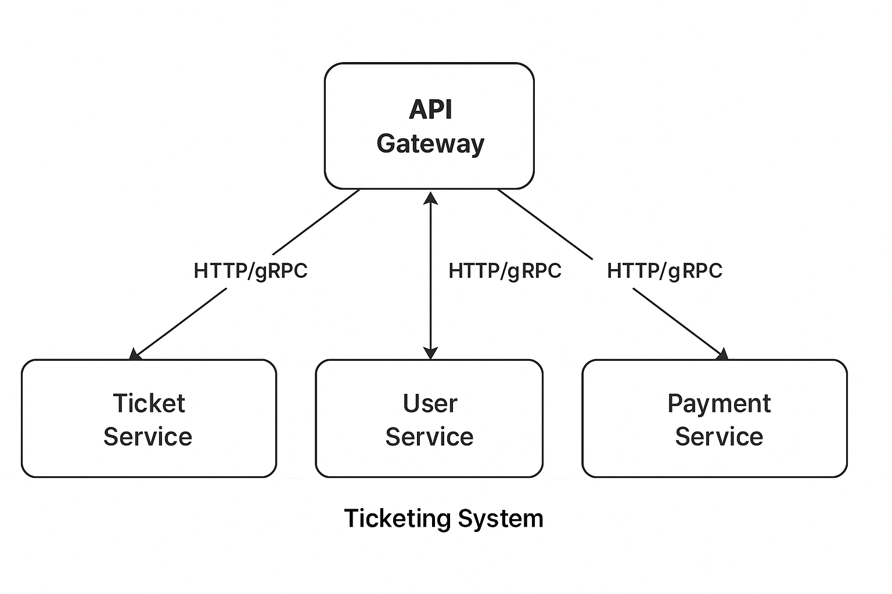

# Ticketing System Architecture

- Client <----> API Gateway <-----> User Service || Ticket service || Payment service || Notification service
- Communication will be via gRPC or HTTP if need be in btn services.

**1. API Gateway**

- Entry point for all external requests.
- Handles HTTP requests from web.
- Authenticate requests via JWT.
- Route requests to internal gRPC services

**2. User Service**

- Manage user accounts (signups, login, etc)
- Registration and authentication
- JWT issuance.
- User role handling

**3. Ticket service**

- Event management (CRUD events)
- Availability
- Ticket booking

**4. Payment service**

- Handle all money transactions
- Verify transaction status

**5. Notification service**

- Notify users via email

**6. Docker & K8S**
